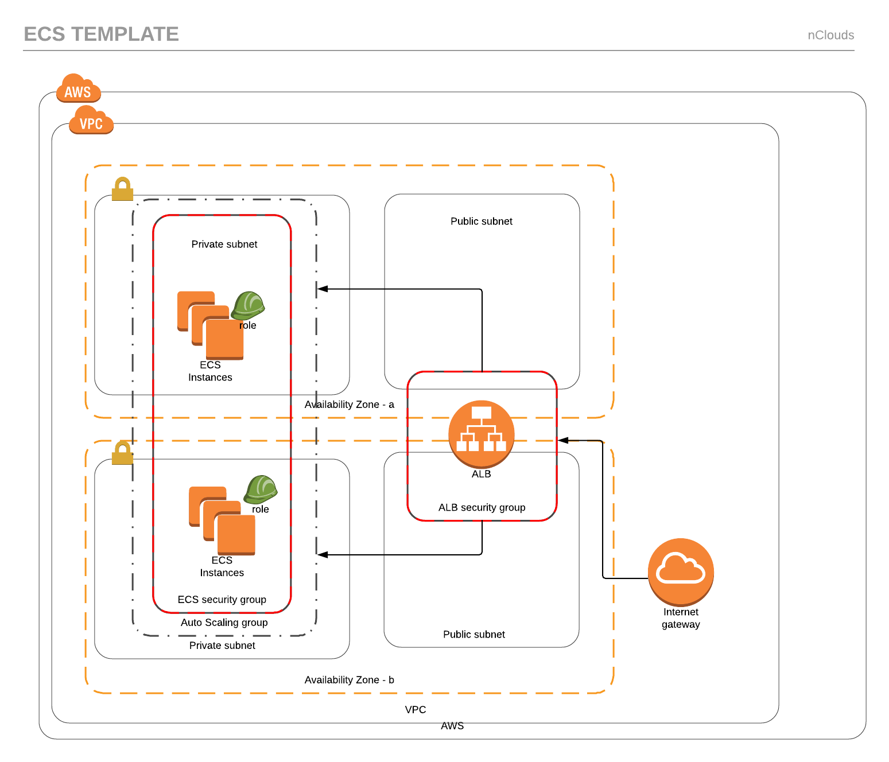
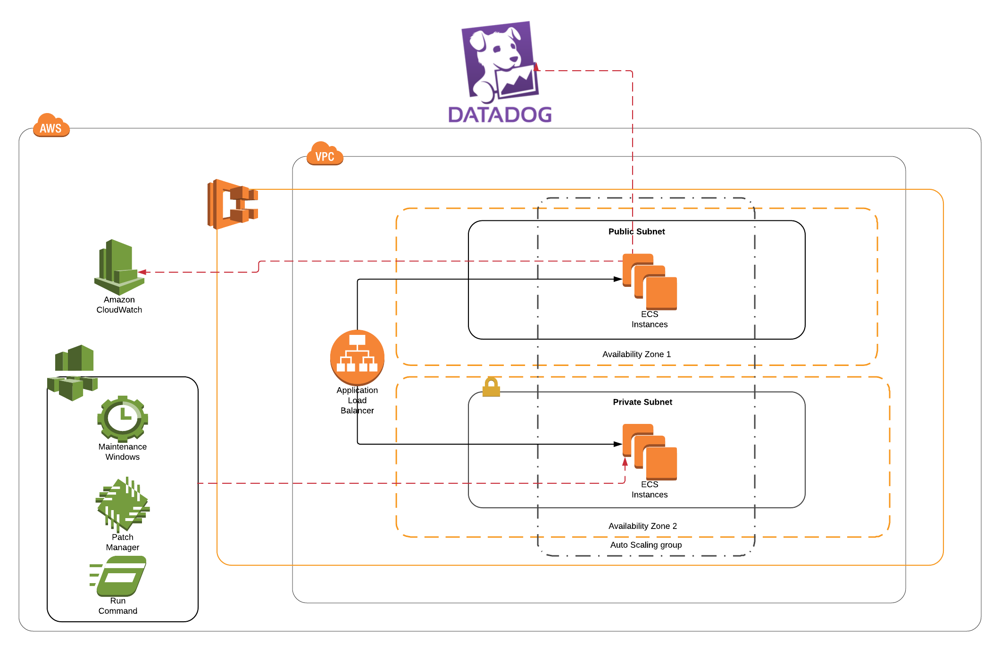

# AWS ECS

Amazon Elastic Container Service (Amazon ECS) is a highly scalable, high-performance container orchestration service that supports Docker containers and allows to easily run and scale containerized applications on AWS. Amazon ECS eliminates the need for you to install and operate your own container orchestration software, manage and scale a cluster of virtual machines, or schedule containers on those virtual machines.

## Fargate
AWS Fargate is a compute engine for Amazon ECS that allows you to run containers without having to manage servers or clusters. With AWS Fargate, you no longer have to provision, configure, and scale clusters of virtual machines to run containers.


To Spin up an aplication on ECS you need to define a Service and Tasks Definitions:
- A service allows you to run and maintain a specified number of instances of a task definition simultaneously in the ECS cluster
- A task definition is the way you define the docker containers that you want to run. You specify some parameters like the image, roles, and cpu and memory to use with each task.

## EC2
With ECS running on EC2 instances you are responsible of deploying the required infrastructure. You need to configure and manage the EC2 instances and the scaling policies.



### ECS vs Fargate pricing
#### EC2
Using a scenario of an ECS cluster running 1 month
- 342 tasks
- 26 Instances m4.xlarge (4vCPU and 16GB at $0.2/h)

```The cost is $3,744```

#### Fargate
Using the same scenario:
- 0.25vCPU per Task
- 0.58 GB

At a price of:
- vCPU $0.04048/h
- GB $0.004445/h

```The cost is $3,126```

When using on demand instances the price of a Fargate cluster is less than the ECS cluster usin EC2, but we have to take into account that with EC2 we can make use of the reserved instances that reduces the cost around a 60%

### Choosing EC2 or Fargate
Choosing one or another depends on the needs of every organization
- Fargate reduces time of development by focusing on the application and allows to scale faster
- EC2 provides more control over the EC2 instances to support compliance and governance requirements, or broader customization options

## Monitorig
This templates uses different ways to monitor the application and infrastructure associated with it, following nclouds best practices.

### AWS CloudWatch
CloudWatch monitors AWS resources and applications in real time. It allows to collect and track metrics that are important to measure.

### DataDog
The agent is installed on the ECS instances allowing to send data and metrics to the DataDog server at different levels:
- Instance
- Container
- Aplication

### System Manager


## CloudFormation

### Parameters