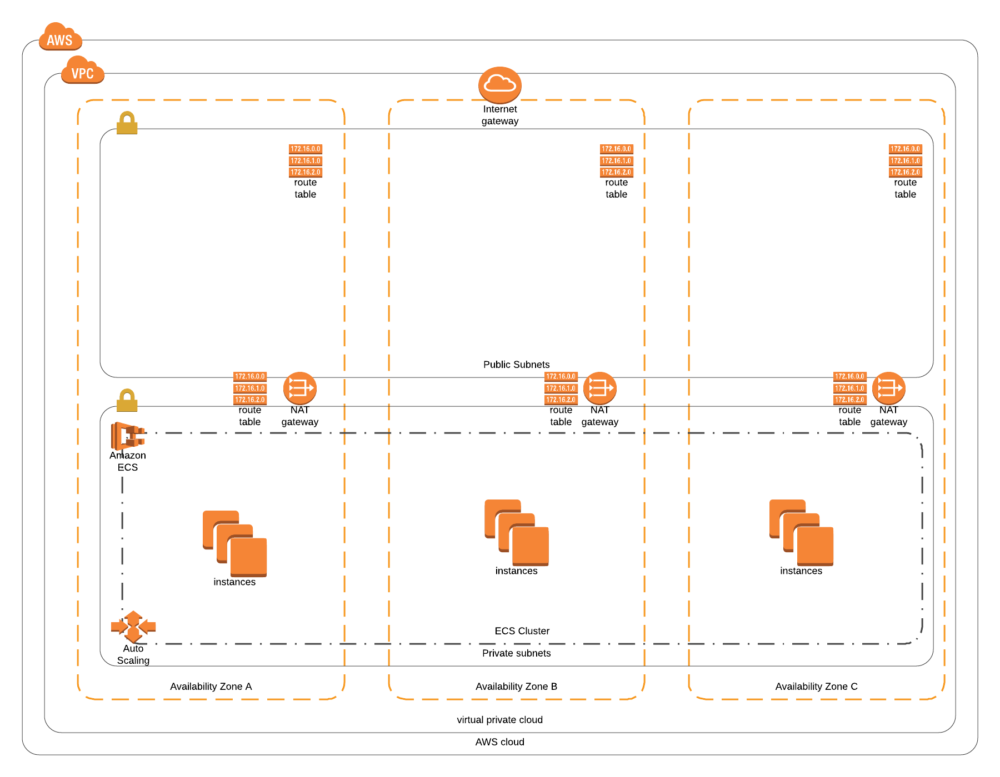

# ECS Cluster

* [Parameters](#parameters)
* [ECS](#ecs)
* [AutoScaling](#autoscaling)

## Parameters

* **QSS3BucketName**: Bucket holding the templates.
* **QSS3KeyPrefix**: Folder name holding the templates.
* **ClusterName**: Name for the cluster (Custom).
* **DesiredCapacity**: Desired capacity for the auto scaling group, count of EC2 instances.
* **MaxBatchSize**: Maximum number of instances to replace at the same time  on updates.
* **MaxSize**: Maximum count of instances of cluster.
* **PauseTime**: Wait time for updates.
* **SpotPrice**: If spot price is 0, then EC2(OnDemand) will be used, otherwise Spot instances will be used.
* **InstanceType**: EC2 Instance type for cluster.
* **SubnetIds**: List of subnets to distribute cluster.
* **VpcId**: VPC identifier.
* **KeyPair**: Key Pair Name for EC2 access.

## ECS
Amazon Elastic Container Service (Amazon ECS) is a highly scalable, high-performance container orchestration service that supports Docker containers and allows you to easily run and scale containerized applications on AWS. Amazon ECS eliminates the need for you to install and operate your own container orchestration software, manage and scale a cluster of virtual machines, or schedule containers on those virtual machines.

**This template is invoked from `main.yml` file.**

* ECS cluster
* ECS IAM Role
* ECS instance profile
* ECS Security group for EC2 instances.

## AutoScaling
AWS Auto Scaling monitors your applications and automatically adjusts capacity to maintain steady, predictable performance at the lowest possible cost. Using AWS Auto Scaling, it’s easy to setup application scaling for multiple resources across multiple services in minutes.

* AutoScaling Group
* Launch Configuration

